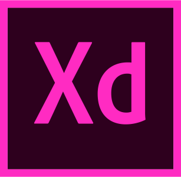

<!--
**Gaurav-71/Gaurav-71** is a ✨ _special_ ✨ repository because its `README.md` (this file) appears on your GitHub profile.

Here are some ideas to get you started:

- 🔭 I’m currently working on ...
- 🌱 I’m currently learning ...
- 👯 I’m looking to collaborate on ...
- 🤔 I’m looking for help with ...
- 💬 Ask me about ...
- 📫 How to reach me: ...
- 😄 Pronouns: ...
- ⚡ Fun fact: ...
-->

# 👨🏻‍💻 &nbsp;About Me

I am Gaurav V an inquisitive learner and a budding developer. My areas of interest include web and mobile development, UI/UX design, software engineering and graphic design.

💡 &nbsp;I like to explore new technologies and develop software solutions and quick hacks.\
🎓 &nbsp;I'm currently studying Computer Science and Engineering at Ramaiah Institute of Technology\
✍️ &nbsp;In my free time, I pursue Graphic Design and Photography\
✉️ &nbsp;You can shoot me an email at gv71.msrit@gmail.com, I'll try to respond as soon as I can.\
📄 &nbsp;Please have a look at my [Resume](./Assets/resume.pdf) for more details about me.

 

# 🤝🏻 &nbsp;Connect with Me

 

# 🛠 &nbsp;Technologies & Tools

### Programming Languages

### Front-end Technologies

### Back-end Technologies

### Web Frameworks

### UI Frameworks

### Databases

### Mobile & Desktop Development

### Version Control Software

### Design & Prototyping

### Hosting & Deployment

 

# ⚙️ &nbsp;GitHub Analytics

  
  

